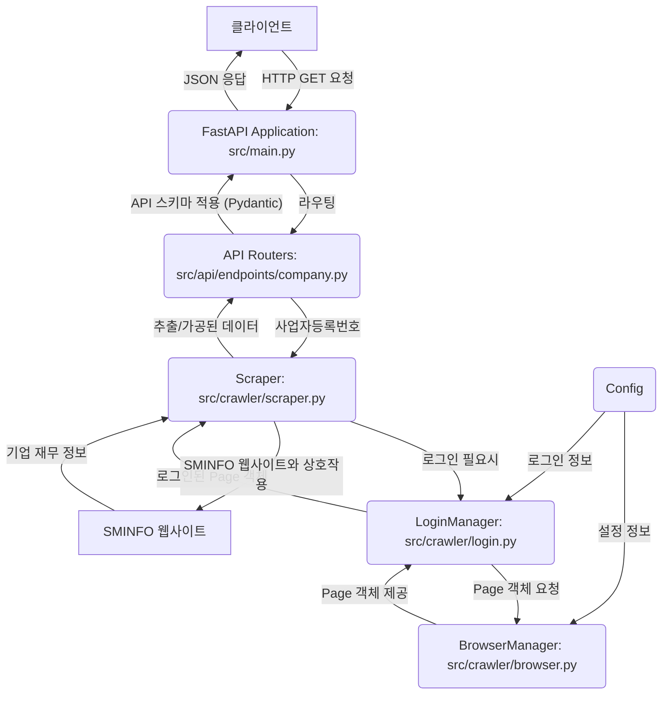

# SMINFO 크롤러 및 API 서비스 시스템 아키텍처

**최종 업데이트:** (오늘 날짜로 가정, 실제 최종 수정일 반영 필요)

## 1. 개요

이 문서는 `sminfo_crawler` 프로젝트의 주요 구성 요소(모듈), 각 모듈의 책임, 그리고 모듈 간의 상호작용 및 데이터 흐름을 설명합니다. 이 시스템은 Playwright를 사용하여 웹 브라우저를 자동화하여 SMINFO 웹사이트에서 기업 정보를 수집하고, FastAPI를 통해 수집된 정보를 API 형태로 제공합니다.

## 2. 주요 구성 요소 (모듈)

다음은 프로젝트의 핵심 구성 요소입니다.

-   **`Config` (설정 관리 모듈 - `src/crawler/config.py` 또는 `src/core/config_global.py`)**
    -   **책임**: 시스템 실행에 필요한 설정 값(로그인 계정 정보, 대상 URL, 브라우저 옵션, CSS 선택자, API 포트 등)을 관리하고 제공합니다.
    -   **구현**: 주 설정 방식은 프로젝트 루트의 `.env` 파일을 사용하는 것이며, Pydantic `BaseSettings` 또는 `python-dotenv` 라이브러리를 통해 Python 코드에서 이 환경 변수들을 로드합니다. 이 `.env` 파일은 Git 저장소에서 제외됩니다.

-   **`BrowserManager` (브라우저 관리 모듈 - `src/crawler/browser.py`)**
    -   **책임**: Playwright 라이브러리를 사용하여 브라우저 인스턴스(예: Chromium)의 생명주기를 관리합니다. 브라우저 시작, 설정(headless 모드, user-agent, viewport 등), 새 `Page` 객체 생성, 브라우저 종료 등의 기능을 수행합니다.
    -   **상호작용**: `LoginManager` 및 `Scraper` 모듈에 `Page` 객체를 제공하여 실제 웹 상호작용이 가능하도록 합니다. `async with` 문을 통해 자원 관리를 자동화할 수 있도록 설계됩니다. API 요청 처리 시 브라우저 인스턴스를 효율적으로 재사용하거나 관리하는 전략이 필요합니다.

-   **`LoginManager` (로그인 관리 모듈 - `src/crawler/login.py`)**
    -   **책임**: `BrowserManager`로부터 받은 `Page` 객체를 사용하여 SMINFO 웹사이트에 대한 자동 로그인을 처리합니다. 로그인 상태 확인 및 로그아웃 기능도 포함합니다.
    -   **상호작용**: `Config` 모듈에서 로그인 계정 정보를 가져오고, `BrowserManager`에서 제공된 `Page` 객체를 통해 웹 요소와 상호작용합니다. API 요청 시 필요에 따라 로그인 세션을 확보합니다.

-   **`Scraper` (데이터 스크래핑 모듈 - `src/crawler/scraper.py`)**
    -   **책임**: `LoginManager`를 통해 로그인된 세션의 `Page` 객체를 사용하여, 특정 검색 조건(예: 사업자등록번호)에 따라 기업 정보를 검색하고, 검색 결과 페이지 또는 상세 페이지에서 필요한 데이터(기본 정보, 연도별 재무 정보 등)를 추출합니다.
    -   (신규) 데이터 검증 및 디버깅을 목적으로, 재무 정보 추출 대상 페이지의 HTML 소스 코드를 지정된 경로에 파일로 저장합니다.
    -   **상호작용**: `BrowserManager` (또는 `LoginManager`를 통해 전달받은) `Page` 객체를 사용합니다. Playwright API와 BeautifulSoup을 혼용하여 웹 페이지 요소에 접근하고 데이터를 파싱합니다. FastAPI의 API 요청에 따라 특정 기업 정보를 크롤링합니다.

-   **`(신규) FastAPI Application` (`src/main.py`)**
    -   **책임**: FastAPI 애플리케이션의 메인 인스턴스입니다. API 라우터 등록, 미들웨어 설정, 애플리케이션 생명주기 이벤트(시작, 종료) 관리 등을 담당합니다.
    -   **상호작용**: `API Routers`를 포함하여 API 요청을 해당 핸들러로 전달하고, 전역적인 설정을 관리합니다. Uvicorn과 같은 ASGI 서버에 의해 실행됩니다.

-   **`(신규) API Routers` (라우팅 모듈 - 예: `src/api/endpoints/company.py`)**
    -   **책임**: 특정 API 엔드포인트(예: `/api/v1/company-financials/{business_registration_number}`)에 대한 요청을 받아 처리 로직을 수행합니다. `Scraper` 모듈을 호출하여 데이터를 가져오고, `API Schemas`를 사용하여 응답을 구성합니다.
    -   **상호작용**: `FastAPI Application`에 등록되어 특정 경로의 HTTP 요청을 처리합니다. `Scraper` 모듈 및 `API Schemas`와 상호작용합니다.

-   **`(신규) API Schemas/Models` (데이터 모델 모듈 - 예: `src/api/schemas.py`)**
    -   **책임**: Pydantic을 사용하여 API 요청 파라미터 및 응답 본문의 데이터 구조를 정의하고 유효성을 검사합니다. 데이터 직렬화 및 역직렬화를 담당합니다.
    -   **상호작용**: `API Routers`에서 요청 데이터를 검증하고 응답 데이터를 구성하는 데 사용됩니다.

-   **실행 스크립트 (선택 사항 - 예: 배치 크롤링용 스크립트)**
    -   **책임**: (API와 별개로) 특정 조건에 따라 대량의 데이터를 주기적으로 크롤링하거나, 개발/테스트 목적으로 크롤러 모듈을 직접 실행하는 역할을 할 수 있습니다.
    -   **상호작용**: `Config`, `BrowserManager`, `LoginManager`, `Scraper` 모듈의 기능을 순차적으로 호출하고 관리합니다.

## 3. 모듈 간 상호작용 및 데이터 흐름

### 3.1. API 요청 처리 흐름

**API 요청 데이터 흐름 설명:**

1.  **요청 수신**: 클라이언트가 사업자등록번호를 포함하여 API 엔드포인트로 GET 요청을 보냅니다.
2.  **라우팅 및 검증**: `FastAPI Application`은 요청을 수신하여 등록된 `API Router`로 전달합니다. `API Router`는 Pydantic `API Schema`를 사용하여 경로 매개변수를 검증할 수 있습니다.
3.  **크롤링 준비**: `API Router`는 `Scraper` 모듈을 호출합니다. `Scraper`는 필요시 `LoginManager`를 통해 SMINFO 로그인 세션을 확보합니다. `LoginManager`는 `BrowserManager`를 통해 Playwright `Page` 객체를 얻고, `Config`에서 계정 정보를 가져와 로그인합니다.
4.  **데이터 크롤링**: `Scraper`는 확보된 `Page` 객체와 사업자등록번호를 사용하여 SMINFO 웹사이트에서 해당 기업의 연도별 매출액 및 영업이익을 크롤링합니다.
5.  **데이터 가공 및 응답 생성**: `Scraper`는 추출된 데이터를 `API Router`로 반환합니다. `API Router`는 이 데이터를 `API Schema`에 정의된 응답 형식으로 가공하여 `FastAPI Application`에 전달합니다.
6.  **응답 전송**: `FastAPI Application`은 최종 JSON 응답을 클라이언트에게 반환합니다.

### 3.2. (선택 사항) 배치 크롤링 흐름 (기존 흐름과 유사)

(기존 PRD의 흐름도 또는 유사한 흐름이 여기에 위치할 수 있습니다. API 서버와는 별도로 크롤러만 실행하는 경우입니다.)

## 4. 주요 설계 결정 사항 및 이유

-   **Playwright 사용**: SMINFO 웹사이트가 동적 컨텐츠(JavaScript 로딩)를 포함할 가능성이 있고, 안정적인 로그인 및 상호작용을 위해 실제 브라우저 환경을 제어하는 Playwright를 핵심 라이브러리로 선택했습니다.
-   **FastAPI 사용 (신규)**: Python 기반 API 개발을 위해 현대적이고 빠른(고성능) 웹 프레임워크인 FastAPI를 선택했습니다. 비동기 지원, 자동 API 문서 생성(Swagger UI, ReDoc), Pydantic을 통한 강력한 데이터 유효성 검사 및 직렬화 기능을 제공하여 개발 생산성과 API 품질을 높입니다.
-   **모듈화된 설계**: `BrowserManager`, `LoginManager`, `Scraper`, `API Routers` 등 기능을 기준으로 모듈을 분리하여 코드의 재사용성, 유지보수성, 테스트 용이성을 향상시킵니다.
-   **`BeautifulSoup` 보조 사용 (`scraper.py`)**: Playwright로 동적으로 페이지를 로드한 후, 복잡한 HTML 구조를 파싱하거나 특정 조건에 맞는 요소를 찾기 위해 `BeautifulSoup`의 강력한 파싱 기능을 보조적으로 활용합니다.
-   **설정 분리 (`Config` 및 `.env`)**: 민감 정보(로그인 계정) 및 자주 변경될 수 있는 값(URL, API 포트, 주요 선택자)을 코드 외부(`.env` 파일 등) 또는 별도 설정 모듈로 분리하여 보안 및 관리 용이성을 높입니다.
-   **비동기 처리 (`async`/`await`)**: Playwright와 FastAPI 모두 비동기 처리를 기반으로 하므로, 전체 시스템에서 I/O 바운드 작업(네트워크 요청, 브라우저 상호작용, API 요청/응답 처리)의 효율성을 극대화하기 위해 비동기 프로그래밍 모델을 적극 채택합니다.

## 5. 추후 개선 방향

-   에러 처리 및 재시도 로직 강화 (크롤러 및 API 양쪽 모두).
-   페이지네이션 로직의 일반화 및 안정성 향상 (배치 크롤링 시).
-   CSS 선택자의 중앙 관리 및 외부 파일화 (`Selector.md` 활용 또는 별도 설정 파일).
-   로그인 세션 관리 고도화 (예: 세션 풀링, 만료 시 자동 재로그인).
-   데이터 저장 방식의 다양화 (예: DB 연동하여 API 응답 속도 개선 및 데이터 영속성 확보).
-   API 인증 및 인가 메커니즘 도입 (예: API 키, OAuth2).
-   API 요청량 제한(Rate Limiting) 및 모니터링.
-   데이터 캐싱 전략 구현 (API 응답 속도 개선 및 SMINFO 서버 부하 감소).
-   비동기 작업 큐(Celery 등)를 이용한 장시간 크롤링 작업의 백그라운드 처리.
-   더욱 상세한 로깅 및 모니터링 시스템 구축. 